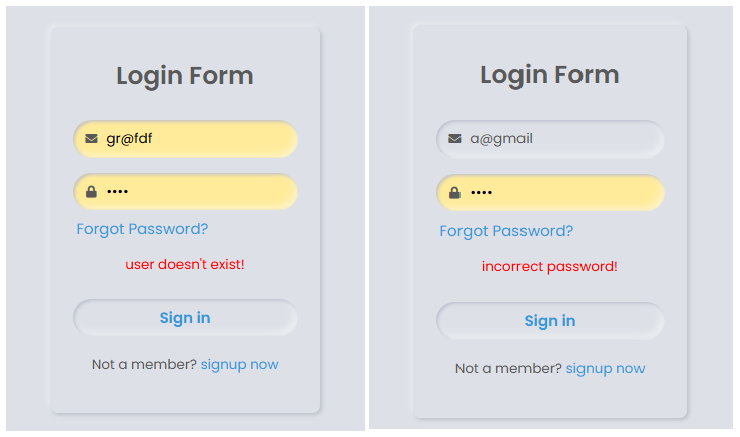
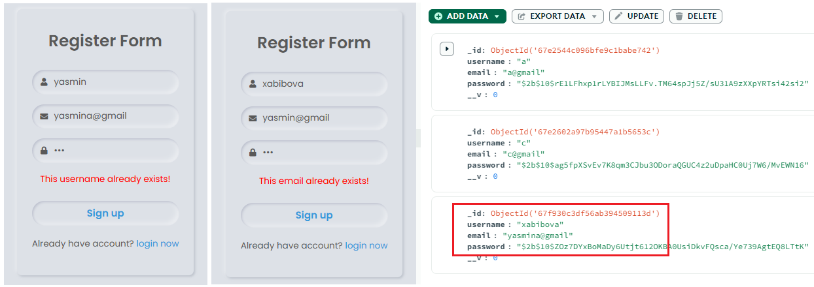
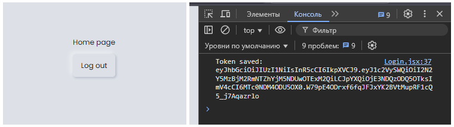
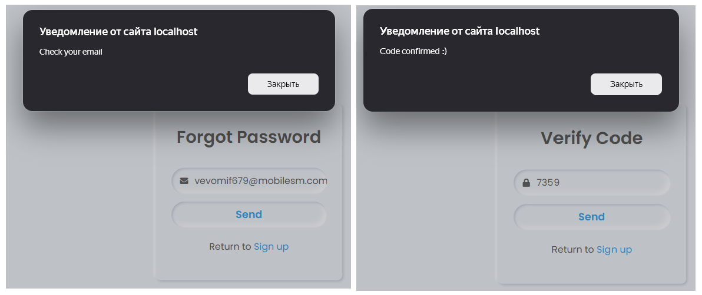
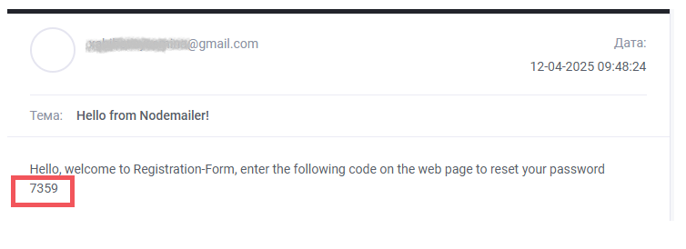
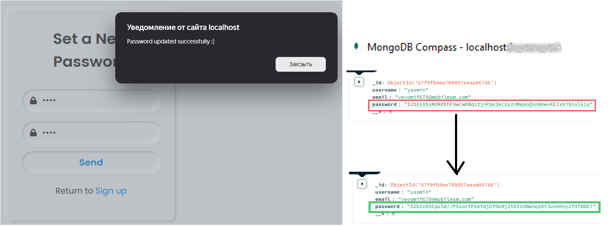

# 🚀 Registration Form - MERN Stack


---

📝 **Description:**

This is a full-stack **Registration and Login** system built with the **MERN stack** (MongoDB, Express, React, Node.js). It includes:

- User Registration  
- Email Verification with Code  
- Password Reset via Email  
- Secure Password Hashing  
- Responsive Frontend

---

## ⚙️ Technologies Used

- 🟢 **MongoDB** – Database for storing application data  
- ⚙️ **Express.js** – Backend framework for building RESTful APIs  
- 🌐 **React.js** – Frontend library for creating dynamic user interfaces  
- 🔵 **Node.js** – JavaScript runtime environment for server-side development  
- 🔐 **Bcrypt** – For securely hashing user passwords  
- 📬 **Nodemailer** – For sending and verifying emails  
- 🌱 **dotenv** – For managing environment variables and secure configurations  
- 🛡️ **JWT (JSON Web Token)** – For user authentication and token-based security

---

## 📸 App views
  
> All pages in the project

---

### 🔑 Login Page
  
> The login page only allows existing users to access the home page.

---

### 🧾 Register Page
  
> New users can sign up using this form. User data is stored in a database, the password is hashed using bcrypt

---

### 🏠 Home Page
  
> A token is issued after entering the application, to verify permission when navigating to other pages

---

### 🔑 Security 
  
> If a user tries to access the site without permission, it redirects them to the /login page
```bash
// client/src/pages/PrivateRoute.jsx

import { Navigate, Outlet } from "react-router-dom";

const PrivateRoute = () => {
   const token = localStorage.getItem("token"); 
   return token ? <Outlet /> : <Navigate to="/login" replace />;
};

export default PrivateRoute;
```

---

### ❓ Forgot Password Page and ✅ Verify Code Page
  
> Users can request a password reset by entering their email.
---
  
> check your email

---

### 🔒 Set New Password Page
  
> You can update your password in the system via the password sent to your email.

---

💻 **Setup Instructions (Backend):**

```bash
# 1. Clone the repo
git clone https://github.com/Yasmina1602/Registration-Form

# 2. Go to the backend folder
cd Registration-Form/server

# 3. Install dependencies
npm install

# 4. Edit .env file and add your Mongo URI and email credentials
PORT=5000
JWT_SECRET=you_can_change
MONGO_URI=your_mongo_connection_string
USER_EMAIL=your_email@gmail.com
APP_PASSWORD=your_app_password

# 5. Run the server
npm start
```

---

💻 **Setup Instructions (Frontend):**

```bash
# 1. Go to the client folder
cd ../client

# 2. Install dependencies
npm install

# 3. Run the frontend
npm run dev
```
---

🙋‍♀️ Author:
Yasmina1602 on GitHub
