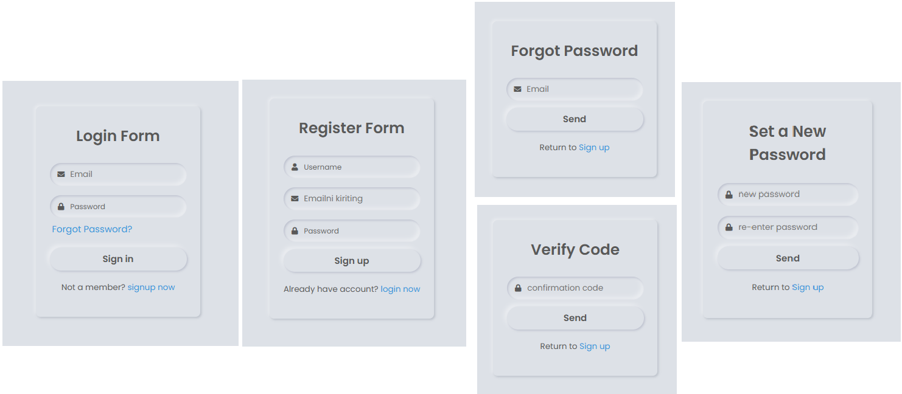
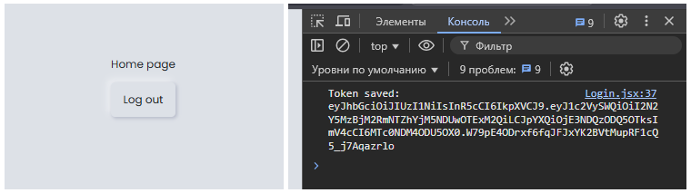
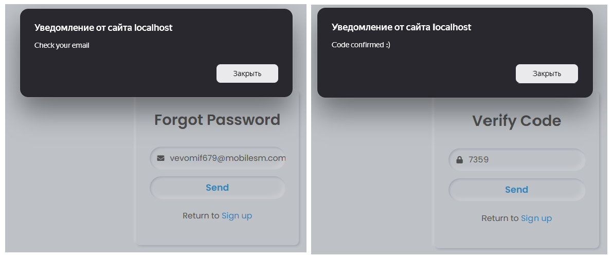
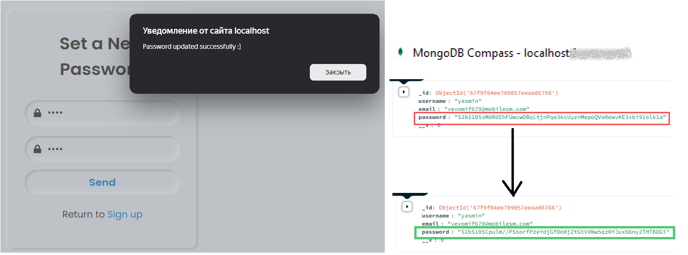

# 🚀 Registration Form - MERN Stack


---

📝 **Description:**

This is a full-stack **Registration and Login** system built with the **MERN stack** (MongoDB, Express, React, Node.js). It includes:

- User Registration  
- Email Verification with Code  
- Password Reset via Email  
- Secure Password Hashing  
- Responsive Frontend

---

⚙️ **Technologies Used:**

- 🟢 **MongoDB** (database)
- ⚙️ **Express.js** (backend framework)
- 🌐 **React.js** (frontend library)
- 🔵 **Node.js** (runtime environment)
- 🔐 **Bcrypt** (for password hashing)
- 📬 **Nodemailer** (for email verification)
- 🔐 **Environment Variables**: `dotenv` for secure configuration
- jwt web token

---

## 📸 App views
  
> All pages in the project

---

### 🔑 Login Page
  
> The login page only allows existing users to access the home page.

---

### 🧾 Register Page
  
> New users can sign up using this form.

---

### 🏠 Home Page
  
> The default landing page after opening the application. log out

---

### 🔑 Security 
  
> The login page only allows existing users to access the home page.

---

### ❓ Forgot Password Page
  
> Users can request a password reset by entering their email.

---

### ✅ Verify Code Page
  
> After receiving the email, users must enter a 4-digit verification code.

---

### 🔒 Set New Password Page
  
> Users can create a new password after successful verification.

---

## 📁 Folder Structure

```bash
├── client/               # React frontend
│   └── public/screenshots/   # Screenshots used in README
├── server/               # Express backend
├── .env                  # Environment variables
├── README.md

---

💻 **Setup Instructions (Backend):**

```bash
# 1. Clone the repo
git clone https://github.com/Yasmina1602/Registration-Form

# 2. Go to the backend folder
cd Registration-Form/server

# 3. Install dependencies
npm install

# 4. Edit .env file and add your Mongo URI and email credentials
PORT=5000
JWT_SECRET=you_can_change
MONGO_URI=your_mongo_connection_string
USER_EMAIL=your_email@gmail.com
APP_PASSWORD=your_app_password

# 5. Run the server
npm start
```

---

💻 **Setup Instructions (Frontend):**

```bash
# 1. Go to the client folder
cd ../client

# 2. Install dependencies
npm install

# 3. Run the frontend
npm run dev
```
---

🙋‍♀️ Author:
Yasmina1602 on GitHub
